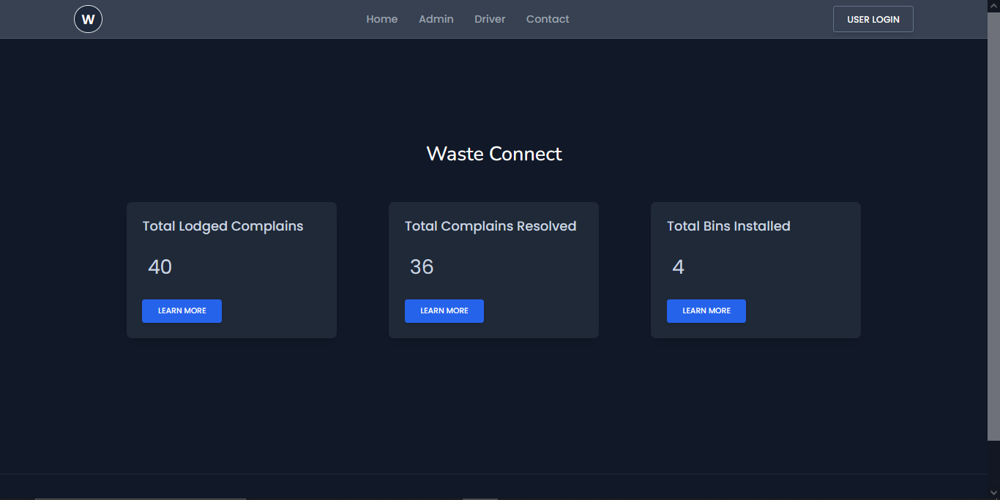
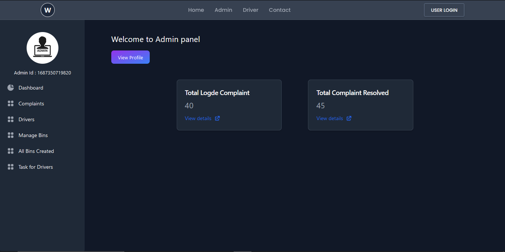
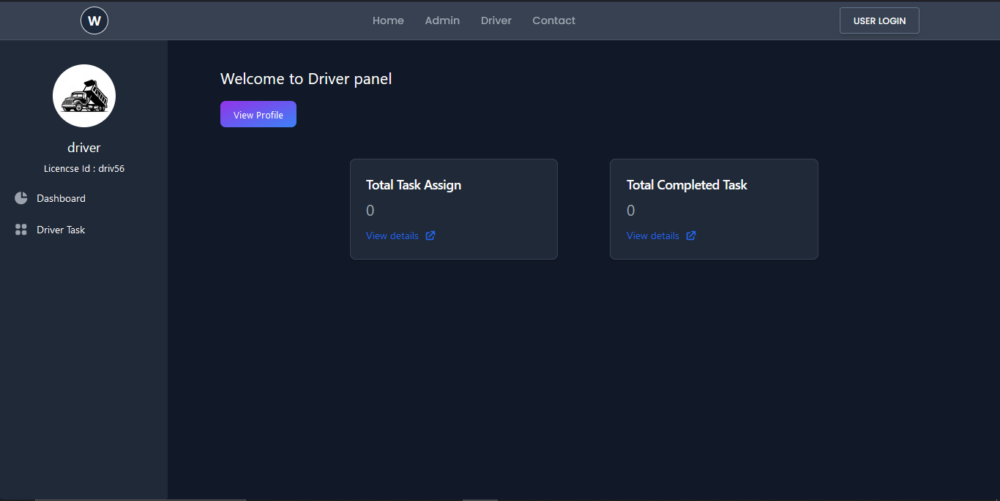

Waste Connect

Waste Connect is a waste management system with scheduling, tracking, and notification features. It is built using React, Express, Node.js, and MongoDB, showcasing the development of a scalable and efficient application with a comprehensive and user-friendly interface.
Features

    Scheduling: Schedule waste collection and management activities based on user requirements.
    Tracking: Track the progress and status of waste management tasks in real-time.
    Notifications: Receive notifications and updates regarding scheduled activities and task completion.
    User Authentication: Provide secure user authentication and access control for system users.
    Driver & Admin: In this project It's having Driver and admin login functionalities and make functionality versatile.

Home Page

Admin Page

Driver Page

Technologies Used

    Frontend: React, Tailwind CSS
    Backend: Express, Node.js
    Database: MongoDB

Installation

    Clone the repository:

bash

git clone https://github.com/alisohail2448/WasteManagement.git

    Install dependencies:

bash

cd client
npm install

cd server
npm install

    Configure the environment variables:
        Create a .env file in the root directory.
        Define the required environment variables in the .env file.
        plz make sure your database connected in proper way.
    Run the application:

sql

cd client 
npm start

cd server 
npm start

    Access the application in your web browser at http://localhost:3000.

Usage

    Register a new account or log in with existing credentials.
    Schedule waste collection and management activities.
    Track the progress and status of scheduled tasks.
    Receive notifications and updates regarding task completion.